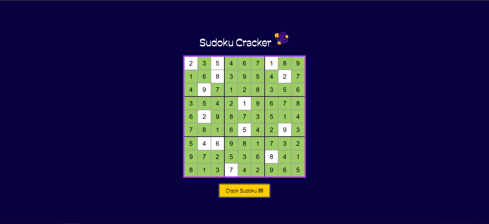

# SudokuCracker

SudokuCracker is a web-based Sudoku solver that allows users to input their own puzzles and solve them instantly with a single click. The application is built using JavaScript, HTML, and CSS, and runs entirely in the browser.

---

## Table of Contents

- [Features](#features)
- [Demo](#demo)
- [How It Works](#how-it-works)
- [Installation](#installation)
- [Usage](#usage)
- [Contributing](#contributing)
- [License](#license)
- [Acknowledgements](#acknowledgements)

---

## Features

- Dynamic 9x9 Sudoku grid generation
- User-friendly interface for puzzle input
- One-click solving with animated visualization
- Highlights user-input cells and solved cells
- Responsive and modern design

---

## Demo

https://gheorghiciucgeorgia.github.io/SudokuCracker/

---

## How It Works

### 1. Dynamic Grid Generation

When the page loads, the script dynamically creates a 9x9 Sudoku grid using HTML table elements. Each cell in the grid contains an input field where users can enter numbers. This ensures the interface is always ready for user input and can be easily reset or updated.

### 2. User Input Handling

Users fill in the Sudoku puzzle by entering numbers into the grid. When the "Solve" button is clicked, the script reads all the values from the grid and constructs a two-dimensional array (matrix) representing the current state of the puzzle. Empty cells are treated as zeros.

### 3. Marking User Inputs

The script identifies which cells were filled by the user and marks them visually (for example, by adding a special CSS class). This distinction ensures that the solver does not overwrite the original user inputs when displaying the solution.

### 4. Solving the Puzzle

The core solving logic uses a recursive backtracking algorithm:
- It searches for empty cells (cells with a value of zero).
- For each empty cell, it tries all possible numbers from 1 to 9.
- Before placing a number, it checks if the move is valid by ensuring the number does not already exist in the same row, column, or 3x3 subgrid.
- If a valid number is found, it is placed in the cell and the algorithm proceeds to the next empty cell.
- If no valid number can be placed, the algorithm backtracks to the previous cell and tries a different number.

### 5. Validating Moves

To maintain Sudoku rules, the script checks for conflicts:
- It ensures that the same number does not appear twice in any row or column.
- It also checks the corresponding 3x3 subgrid to prevent duplicate numbers within that section.

### 6. Displaying the Solution

If a solution is found, the script fills in the solved values into the grid, animating the process for better visualization. Cells that were solved by the algorithm (not by the user) are visually distinguished. If no solution exists, the user is notified.
